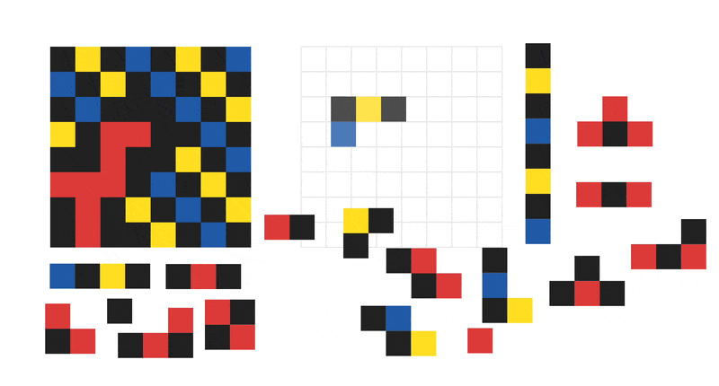
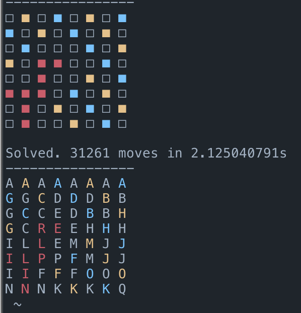

# kaleidoscope puzzle

i used to play this puzzle as a kid and i wanted to write a solver

[this project](https://github.com/pratu16x7/kaleidoscope-solver) takes another cool approach, but it is only implemented for red and black puzzles

i scraped some of the boards from Mike's Kaleidoscope Classic Page ([page 1](http://www.users.on.net/~mikegatley/kaleidoscope/all1.html) and [page 2](http://www.users.on.net/~mikegatley/kaleidoscope/all2.html)) using beautifulsoup and opencv

## Demo

<p>
    
    
</p>

JS-based frontend (left) and terminal-based solver (right). In the solution, each grouping of the same letter represents on piece. The solver currently uses naiive backtracking and is fast on most boards. However, there is still a lot of room for optimization :)


## Running 

to run the frontend
```
npm run dev
```
to run the solver
```
cargo run -- --name australian-emu
```